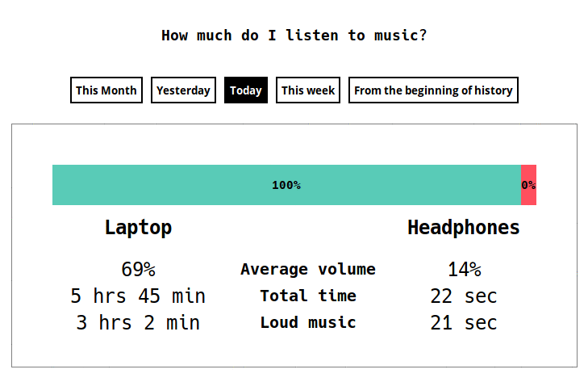

# music-habits

Trying to monitor my speaker/headphone usage on my laptop.



**Table of content**
* [How does this work](#how-does-this-work)
* [Usage](#usage)
* [Why pulseaudio](#why-pulseaudio)
* [Why pactl based C code](#why-using-pactl-based-c-code)
* [Why Golang](#why-golang-for-analysis)
* [Why HTML](#why-html-for-viz)

## How does this work?
**Step 1** Gather data to perform analytics.

**Step 2** Perform analytics on the time-series data obtained.

**Step 3** Create a summary and visualize it.

### Step-1 Gather data
Linux machines using ALSA/[Pulseaudio](https://www.freedesktop.org/wiki/Software/PulseAudio/) play sound using a client-server architecture.
A [C program based on pactl](pactl.c) subscribes to events on output devices and applications playing sound, and logs them to a file in CSV-format.

[See the diff to know the changes made](https://github.com/himanshub16/music-habits/commit/598648e7ac7f047131a623b3b60231799b3adf85#diff-3e6480237f62687e7fb6155633276902)

Sample dumps are available in [examples](examples).

### Step-2 Analysis
  [This Go program](generate_report.go) reads the log file provided and dumps a summary on the console. Additionally, it can start a web server and let you pictorially view in your web browser. HTML is awesome :sunglasses:


### Step-3 Create summary
A text summary is simple to print on terminal screen, but a pictorial view would have been more appealing.
HTML/CSS/JS was the go-to choice here. I tried playing with [gg](https://github.com/fogleman/gg), but gave up after trying hard to center align text. If you can invest that time, please [let me know](#1).

## Usage

Build
```bash
git clone https://github.com/himanshub16/music-habits
cd music-habits
./setup.sh
```

start collecting data
```bash
cd pulseaudio/src
make pactl
./pactl
```

view data collected
```bash
cd pulseaudio/src
tail -f sink*
```

## Why pulseaudio?
Pulseaudio provides a great [API](https://freedesktop.org/software/pulseaudio/doxygen/index.html) on Linux which provides
* list of sound sinks (output devices),
* list of sink-inputs (applications/services producing sound),
* properties as volume, corked (is paused), mute, etc. and also
* subscribe to events.

## Why using pactl based C code?
pulseaudio Python drivers are a great choice to use the library. However, I couldn't find one which provides `corked status` for any sink-input. This is required to know that a sink-input (browser/music player) has paused playing, and there is nothing coming out of the speakers.

This is where C came to rescue. However, due to very tiring nature of C, and after dealing with many naive mistakes (coming back from Python/JavaScript/Golang), I went up to [tweaking](https://github.com/himanshub16/music-habits/commit/598648e7ac7f047131a623b3b60231799b3adf85#diff-3e6480237f62687e7fb6155633276902) `pactl.c` to my use-case, and it works well.

## Why Golang for analysis?
It is just simple loops with some grouping and calculations. Python/NodeJS would be have been easier, but I just wanted to spend more time getting comfortable with Golang.

Additionally, it has a decent web server built in, and has everything you need (I miss you map and filter :sob:).

## Why HTML for viz?
Using an entirely Go based tool is something I would prefer. I gave a lot of try with [gg](https://github.com/fogleman/gg), but after lot of hardwork required to fix and align the text, I gave up and moved to a simpler solution of using HTML and passing data from Golang via a web server.

If you are enthusiastic about giving this a try, [feel free to let me know on this issue](#1).
